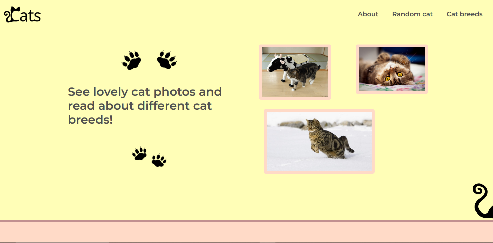
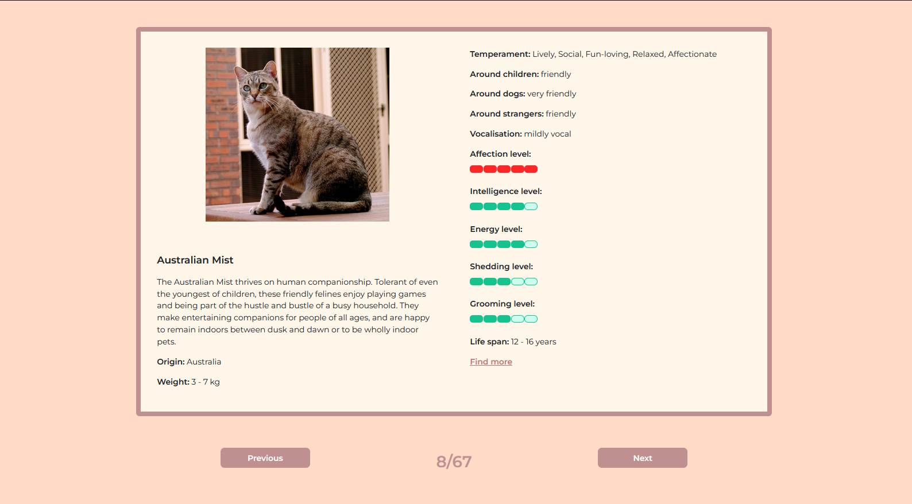
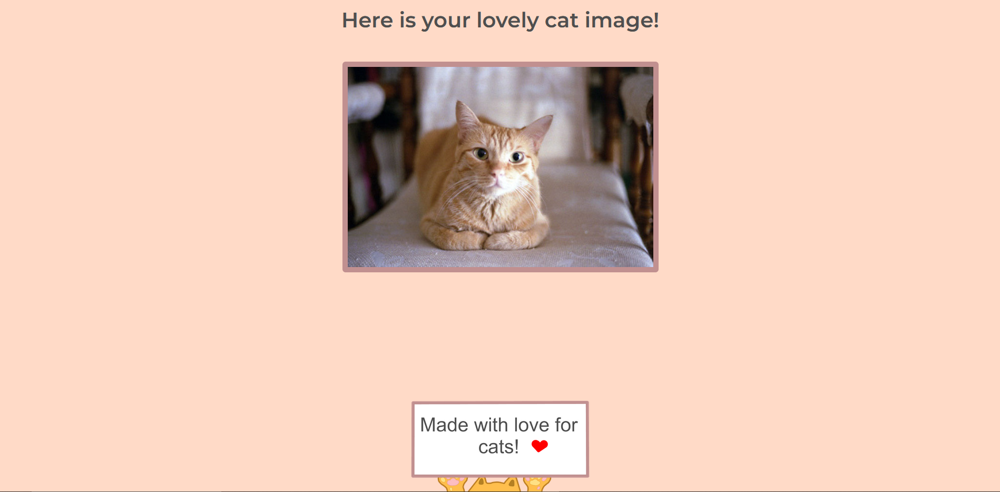

# The CatSite

This app provides an learning space for cat enthusiasts by offering a cat breeds catalog and random funny cat images. 
All this is possible with the use of TheCatAPI which provides images and detailed descriptions of a multitude of cat breeds and random cat images.
## TheCatAPI can be found here
https://developers.thecatapi.com/view-account/ylX4blBYT9FaoVd6OhvR?report=bOoHBz-8t

The welcome section of the page containing the header, text and images.

The catalogue containing description and images of a multitude of cat breeds.

Random cat image which the user can get anytime just by pressing a button.

**App description:**: 
- The page has an header from wich the user can acces the about section, the cat breeds catalog or get a random cat image.
- The welcome section of the page contains a short welcoming text and random cat images resembling photos put on an wall.
- The cat catalogue contains photos and information about over 60 cat breeds, such as: a short description, origin, weight, temperament, energy level etc.
- A random cat image can be shown anytime the user requires it.

## Live App
https://sandravatr.github.io/CatSite/
